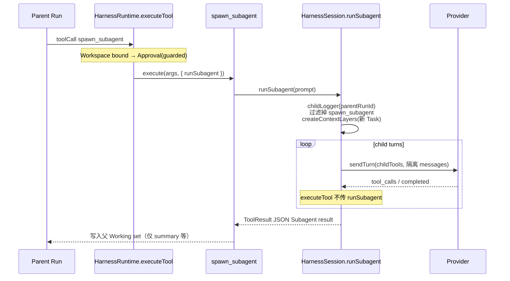

# Subagent 实现原理解析

本文对照 honey 源码，说明 **Subagent（嵌套 Run）** 的设计意图、调用链路、隔离边界与可观测性。权威决策见 [ADR-0012](../docs/adr/0012-subagent-nested-runs.md)；术语以根目录 [`CONTEXT.md`](../CONTEXT.md) 为准。

## 1. 要解决什么问题

编码 Agent 经常需要把「可独立完成的子任务」拆出去，但又不能：

- 只靠切换 system / role prompt（教的是提示词技巧，不是上下文隔离）；
- 为每个子任务开一个新 Session（TUI、Approval、事件日志生命周期会重复一份）。

honey 的答案是：**Subagent = 同一 Session 内的嵌套 Run**。父模型通过受控 Tool `spawn_subagent` 发起；子 Run 有自己的 Task / Working set / Assembled prompt，共享 cwd、Approval、Project instructions 等 Session 级资源。

```text
Session
├── Parent Run (runId = P)
│   ├── Assembled prompt（含父 Transcript / Working set）
│   └── Tool: spawn_subagent(prompt)
│         └── Child Run (runId = C, parentRunId = P)
│               ├── 全新 Assembled prompt（仅见 spawn prompt）
│               └── Tool 面：无 spawn_subagent（深度固定为 1）
└── Session event log（父子事件同写，靠 parentRunId 关联）
```

## 2. 核心契约（一句话版）

| 概念 | 含义 |
|------|------|
| **Subagent** | 同 Session 的嵌套 Run；由 `spawn_subagent` 启动；不复制父 Transcript / Working set |
| **Subagent result** | 回给父 Working set 的结构化 JSON：`summary` / `status` / `run_id`；`summary` 有硬上限 |
| **深度** | 固定为 1：子 Run 的 Tool 列表与 `executeTool` 上下文都不暴露再 spawn |
| **Approval** | `spawn_subagent` 本身是 guarded；子 Run 内的 guarded Tool 走同一 Session Approval 回调 |

## 3. 模块分工

| 文件 | 职责 |
|------|------|
| [`src/tools/spawnSubagentTool.ts`](../src/tools/spawnSubagentTool.ts) | Tool 定义与入参校验；委托 `context.runSubagent` |
| [`src/runtime/subagent.ts`](../src/runtime/subagent.ts) | 常量、`SubagentResult`、summary 截断与 JSON 格式化 |
| [`src/runtime/harness.ts`](../src/runtime/harness.ts) | `HarnessSession.runSubagent`：真正的嵌套 Run 循环 |
| [`src/logging/eventLogger.ts`](../src/logging/eventLogger.ts) | 子 Logger 带 `parentRunId`，事件写入同一 Session log |
| [`src/tools/defaultTools.ts`](../src/tools/defaultTools.ts) | 将 `spawnSubagentTool` 注册进默认 Tool 面 |
| [`src/types.ts`](../src/types.ts) | `EventType` 增加 `subagent_*`；`ToolExecutionContext.runSubagent?` |

父 Run 只「接线」；子 Run 的状态机几乎是父 `runTurn` 的缩影，但**故意不碰**父 Session 上的 `this.transcript` / `this.context` / `this.plan`。

## 4. 端到端调用链



### 4.1 父侧：把「再开一个 Run」塞进 Tool 上下文

父 Turn 在 TOOL_DISPATCH 时，对每个 Tool call 调用 `executeTool`，并**只在父路径**注入 `runSubagent`：

```ts
// harness.ts — parent path
const toolResult = await this.runtime.executeTool(toolCall, {
  logger,
  turnId,
  runSubagent: (prompt) => this.runSubagent(prompt, logger)
});
```

`executeTool` 在过完 Workspace bound 与 Approval 后，把该回调放进 `ToolExecutionContext`：

```ts
return await tool.execute(toolCall.arguments, {
  cwd: this.config.cwd,
  workspaceBound: ...,
  skillRegistry: this.skillRegistry,
  runSubagent: options?.runSubagent
});
```

### 4.2 Tool 层：薄封装

`spawn_subagent` 只做三件事：校验非空 `prompt`、确认 `runSubagent` 存在、调用之。

```ts
// spawnSubagentTool.ts（逻辑摘要）
if (!prompt) return { ok: false, content: "..." };
if (!context.runSubagent) {
  return {
    ok: false,
    content:
      "spawn_subagent is unavailable in this Run (Subagent depth is 1; nested spawn is not allowed)"
  };
}
return context.runSubagent(prompt);
```

深度限制是**双重保险**：子 Provider 请求里根本没有该 Tool；即便误注册，也因缺少 `runSubagent` 而失败。

### 4.3 子侧：`runSubagent` 开一条平行状态机

关键步骤（见 `HarnessSession.runSubagent`）：

1. **新建 `EventLogger`**：同一 `sessionId`，`parentRunId = parentLogger.runId`，`onEmit` 仍 append 到 Session event log。
2. **裁剪 Tool 面**：`definitions().filter(name !== "spawn_subagent")`。
3. **发 `subagent_started` / `run_started`**（payload 带 `nested: true`）。
4. **新建 ContextLayers**：继承 system / projectInstructions / environment / skillCatalog；**新** `task = formatTask(prompt)`；Working set 只有这条 user prompt。
5. **独立 `Plan`**：`createInitialPlan(prompt)`，与父 Plan 无关。
6. **跑与父类似的 Turn 循环**：`MODEL_TURN` → Provider → 可能 `TOOL_DISPATCH` → …  
   子路径调用 `executeTool` 时**不传** `runSubagent`。
7. **结束**：把最终 assistant 文本（或错误文案）收成 `SubagentResult`，emit `subagent_finished` / `run_finished`，作为 Tool result 返回父 Run。

父 Session 字段未被赋值——隔离是「局部变量 + 不写回」，不是拷贝后再同步。

## 5. 隔离边界：继承什么 / 不继承什么

```text
                    继承（Session / Root 级）          不继承（Run 级）
                    ─────────────────────            ─────────────────
cwd / Environment          ✓
Project instructions       ✓
Skill catalog              ✓
systemPrompt 配置          ✓
Approval 回调 / bypass     ✓
Workspace bound 策略       ✓
Provider / maxTurns 等     ✓

父 Transcript              ✗
父 Working set             ✗
父 Plan                    ✗
父 Task 原文（除非写进 spawn prompt）  ✗
子 Transcript → 父 Working set 全文   ✗（只回 Subagent result）
```

**唯一的父 → 子输入通道**是 spawn 参数里的 `prompt`。因此 Tool description 要求「Pass a full prompt」：子模型看不见父聊天历史，委派方必须把背景写进 prompt。

测试 [`harness.test.ts`](../src/runtime/harness.test.ts) 用 `PARENT_CHAT_MARKER` 验证：子 Provider 的 messages / systemPrompt 都不含该标记；父侧 Tool result 只有结构化 summary，不含子读到的无关父文件内容。

## 6. 深度固定为 1：两道闸门

| 闸门 | 位置 | 效果 |
|------|------|------|
| Tool 列表过滤 | `runSubagent` 内 `childTools` | 模型在子 Run 中看不到 `spawn_subagent`，无法发起调用 |
| 回调缺省 | 子 `executeTool(..., { logger, turnId })` 不传 `runSubagent` | 即使 Tool 仍在 registry，execute 也会 soft-fail |

System prompt 也写明委派语义（教学用，不是安全边界）：

> For a self-contained subtask … delegate with `spawn_subagent` … the Subagent cannot spawn further Subagents.

v1 **不做并行 fan-out**：Approval 本质是人对齐的串行队列；多 Run 事件交错是下一刀复杂度。当前实现是「一次 spawn，同步跑完再回父」。

## 7. Approval：同 Session 策略继承

`spawn_subagent` 的 `risk: "guarded"`。父要 spawn，必须：

- 走 `requestApproval`，或
- `--allow-guarded-tools` 自动放行。

子 Run 里的 `apply_patch` 等 guarded Tool 走**同一** `this.config.requestApproval`（同一 Runtime / Session 配置）。测试期望审批顺序为：

```text
["spawn_subagent", "apply_patch"]
```

拒绝 spawn 时 soft-deny：返回失败 Tool result，**不** abort 父 Run，且不会出现 `subagent_started` 事件。

这与「子 Run 自动放行所有 guarded」刻意相反——ADR 明确要对齐 Codex/Claude「继承父策略」的教学点。

## 8. 回传：Subagent result，而不是子 Transcript

```ts
// subagent.ts
export interface SubagentResult {
  summary: string;
  status: "completed" | "error";
  run_id: string;
}

export const SUBAGENT_SUMMARY_MAX_CHARS = 8_000;
```

`formatSubagentResult` 会截断 `summary` 再 `JSON.stringify`。父 Working set 只吃这一小段；子全过程细节留在 Session event log，用 `run_id` + `parentRunId` 串起来。

| 字段 | 用途 |
|------|------|
| `summary` | 给父模型继续推理的短结论（有硬 cap，防撑爆父上下文） |
| `status` | `completed` / `error`；同时映射到 `ToolExecutionResult.ok` |
| `run_id` | 子 Logger 的 `runId`，便于在 event log 里跳转 |

## 9. 可观测性：事件如何串起来

`EventLogger` 构造时可带 `parentRunId`；每次 `emit` 都会把该字段写到 `HarnessEvent`：

```ts
const event: HarnessEvent = {
  timestamp: ...,
  runId: this.runId,          // 子事件 = 子 runId
  turnId,
  type,
  payload,
  sessionId: ...,
  parentRunId: this.parentRunId  // 指向父 Run
};
```

新增事件类型：

- `subagent_started` — payload 含 prompt、父子 runId
- `subagent_finished` — payload 含 status、summary 长度等

同一 Session 的 JSONL 里，父 `run_*` 与子 `subagent_*` / 子 `model_request` 交错出现；过滤 `parentRunId === P` 即可还原一次委派的子树。

## 10. 为什么不是别的形状（ADR 摘要）

| 备选 | 为何不用（v1） |
|------|----------------|
| 同一 Assembled prompt 里换角色 | 不教上下文隔离 |
| 每 Subagent 新 Session | 重复 Session/TUI/Approval，教学收益低 |
| Tool 名叫 `task` | 与领域词 **Task**（目标 / 验收框）冲突 |
| 共享父 Working set / 回传全文 Transcript | 隔离塌掉，父上下文膨胀 |
| 子 Run 自动 allow guarded | 与主流「继承父策略」不符 |
| v1 并行多 spawn | Approval 串行 + 事件交错，另开一刀 |

## 11. 读代码推荐路径

1. [`docs/adr/0012-subagent-nested-runs.md`](../docs/adr/0012-subagent-nested-runs.md) — 决策与非目标  
2. [`src/tools/spawnSubagentTool.ts`](../src/tools/spawnSubagentTool.ts) — Tool 面  
3. [`src/runtime/subagent.ts`](../src/runtime/subagent.ts) — 结果契约  
4. [`src/runtime/harness.ts`](../src/runtime/harness.ts) — `runSubagent` + 父路径注入 `runSubagent`  
5. [`src/runtime/harness.test.ts`](../src/runtime/harness.test.ts) — 隔离、Approval、soft-deny 行为规格  

---

*文档对应当前仓库实现（ADR-0012 / nested Run via `spawn_subagent`）。并行 spawn 与更深嵌套若后续引入，隔离与 Subagent result 契约预期可复用。*
