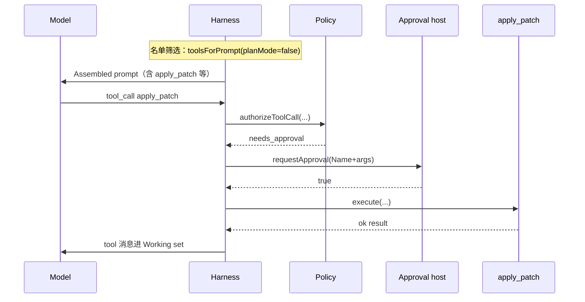

# 权限门禁实现原理解析

**问题：** 编码 Agent 运行时如何统一决定「给模型看哪些工具」和「这次调用能不能真执行」，同时让拒绝原因可解释、可审计？

**契约：** **Policy** 是 Harness（运行时协调层）拥有的唯一 Tool 权威决策面：组装 Assembled prompt 时筛出**给模型看的工具名单**；模型真发起调用时返回**具名多轴**调度结果（不是一个模糊的 allow/deny）。**Approval**（问人仪式）由 Harness 执行，不是 Policy 内部弹窗；人拒绝也不是 Policy 的 outcome。

**读者：** 有通用编程基础、第一次接触 honey 权限子系统的人。读完应能不翻仓库讲清：两道时机各自交什么卷、各轴按什么顺序短路、问人发生在哪一层；并能口述 `toolsForPrompt`、`authorizeToolCall`、`executeTool` 的主路径。

权威决策见 [ADR-0015](../docs/adr/0015-policy-decision-surface.md)；轴语义另见 [ADR-0009](../docs/adr/0009-interactive-approval-for-guarded-tools.md)（Approval）、[ADR-0010](../docs/adr/0010-workspace-bound-for-path-tools.md)（Workspace bound）。术语以根目录 [`CONTEXT.md`](../CONTEXT.md) 为准。英文资料里的 offer-time ≈「筛给模型看的工具名单」；dispatch-time ≈「调度这次调用」。

**Unpack（概念）：** 多轴 Policy vs 单 verdict；名单筛选 vs 调度两时机；Approval 仪式与 Policy outcome 的边界。

**Dissect（实现）：** `isToolAllowedByPosture` / `toolsForPrompt`；`authorizeToolCall`；`HarnessRuntime.executeTool`（含 Approval 握手）；`checkToolCallWorkspaceBound`（Bound 轴如何被 Policy 调用）。

## 1. 要解决什么

模型一开口就要两样东西：

1. **工具说明书**——Assembled prompt（本轮唯一发给模型的上下文）里挂哪些 Tool 定义；
2. **执行许可**——模型真的发出一次 Tool call 时，能不能跑到 `tool.execute`。

若这两处各写一套 if，就会出现「提示里不给，但调度忘了挡」或反过来。若再把「路径越界」「人点拒绝」「Plan Mode 不许」压成同一个布尔值，Session 事件日志和 Soft failure（失败但仍让 Run 继续的工具结果）文案也会糊成一类。

honey 的非目标（ADR-0015 本轮）：不做 Session remember / 永久 allowlist；不做 policy 配置文件；不做 `exec_command` 进程沙箱。先立**可扩展的决策面**，行为与收口前等价。

答案形状：**一个 Policy 入口，多轴具名结果；问人仍是独立仪式。**

## 2. 核心契约

先装一张「两道闸门、多种拒绝理由」的心智图：

```text
工具柜（ToolRegistry 全量定义）
        │
        ▼ 名单筛选（组装 Assembled prompt 之前）
   Policy.toolsForPrompt ──► 本轮塞进 prompt 的工具说明书
        │
        │  （模型仍可能硬调名单外的名字）
        ▼ 调度（executeTool：真要跑某次调用）
   Policy.authorizeToolCall ──► 具名 outcome
        │
        ├─ unknown / plan_denied / blocked / bound_reject
        │       └──► Soft failure（不问人）
        ├─ needs_approval
        │       └──► Harness 问人（Approval）── 允许则 execute；拒绝则 Soft failure
        └─ allow
                └──► tool.execute
```

| 概念 | 含义 |
|------|------|
| **Policy** | Tool 权威决策面：管「给模型看哪些工具」+「这次调用是否放行」；编排各轴，不吞掉轴的名字 |
| **ToolRisk** | Tool 定义上的静态标签：`safe` / `guarded` / `blocked` |
| **Workspace bound** | 路径几何轴：带 `pathParams` 的参数必须落在 Session `cwd` 的 realpath 下 |
| **Approval** | 人对单次 guarded 调用的暂停与决定；Policy 最多判到「需要问」 |
| **Soft failure** | 以失败 Tool 结果写回 Working set（Assembled prompt 里「最近对话 + 工具 I/O」那一层），Run 继续；模型下轮可改参数或换工具 |

**Example（同一调用，两种不同「不行」）：**

- Plan Mode 下模型调 `apply_patch` → Policy 出 `plan_denied` → Soft failure 写「Plan Mode 不许」→ **不问人**。
- 普通模式下 `apply_patch` 路径合法且 bypass 关闭 → Policy 出 `needs_approval` → TUI 弹确认 → 你点 No → Soft failure 写「User denied Approval」→ **这是 Approval 结果，不是 Policy outcome**。

## 3. 概念地图：零件怎么协作

不要按「有几个安全模块」想，按「谁判决、谁问人、谁写失败文案」想：

```text
Session 姿态（planMode）──┐
ToolRisk（定义上）────────┤
cwd + pathParams ─────────┼──► Policy（判决）
allowGuardedTools ────────┤         │
workspaceBound 开关 ──────┘         │
                                    ├─► Soft failure 文案（Harness 按 kind 映射）
                                    └─► needs_approval 时
                                              └─► requestApproval（宿主 UI）
                                                    └─► approval_* 事件
```

协作关系一句话：**Policy 只回答「权威上怎样」；Harness 负责把答案变成 Soft failure、事件，或真正的 `execute`；Approval 是人机暂停，挂在 `needs_approval` 之后。**

旁路开关是 Policy **输入**，不是平行旁路：

- `--allow-guarded-tools` → `allowGuardedTools: true` → guarded 直接 `allow`，跳过问人；
- `--no-workspace-bound` → `workspaceBoundEnabled: false` → 跳过路径轴。

两者正交：开了 guarded bypass，Bound 默认仍开（ADR-0010）。

## 4. 端到端链路

**情景：** 用户在 Session TUI 里让模型改 `note.txt`；模型发出 `apply_patch`；你点允许。



若路径是 `../secret.txt`：Policy 在 Bound 轴短路为 `bound_reject`，**不会**走到 Host——越界不值得浪费一次确认（ADR-0010）。

## 5. 关键边界 / 易混点

| 容易混成 | 实际边界 |
|----------|----------|
| Policy = Approval | Policy 判决；Approval 是问人仪式。人拒绝 ∉ Policy outcome |
| ToolRisk = 读写权限 | ToolRisk 只标 risk 档；路径逃逸由 Bound 管，与 safe/guarded 无关 |
| Workspace bound = 沙箱 | Bound 只管声明了的路径参数；**不**限制 `exec_command` 进程逃逸 |
| 名单挡住 = 调度挡住 | 名单只影响「模型看见什么」；调度仍 fail-closed——硬调名单外工具也会被拒 |
| Soft failure = Run 结束 | Soft failure 继续 Turn；Hard failure（如 Provider 挂）才 ERROR |

**Example（safe 也会撞 Bound）：** `read_file` 是 `safe`，从不进 Approval；但若 `path=../x`，Policy 仍出 `bound_reject`。这正是 ADR-0010 要把 Bound 做成独立轴的原因——安全读文件是安静的外泄通道。

## 6. 机制深挖

### 6.1 Unpack：多轴 outcome 长什么样

调度侧 `PolicyDispatchOutcome` 的 `kind` 就是轴的名字（摘自 [`policy.ts`](../src/runtime/policy.ts)）：

| `kind` | 含义 | 典型 Soft failure 开头 |
|--------|------|------------------------|
| `unknown_tool` | 注册表里没有这个名字 | `Unknown tool: …` |
| `plan_denied` | 姿态不允许（Plan allowlist，或非 Plan 调 `update_plan`） | `Tool not available in Plan Mode` / `update_plan is only available…` |
| `blocked` | ToolRisk = blocked | `Blocked tool: …` |
| `bound_reject` | 路径逃出 cwd | `Workspace bound rejected path…` |
| `needs_approval` | guarded 且未开 bypass | （尚未失败；Harness 去问人） |
| `allow` | 权威上可执行 | （进入 `execute`） |

**没有** `approval_denied`：人点 No 之后，Harness 直接拼 Soft failure，不再回 Policy。

### 6.2 Dissect：`isToolAllowedByPosture` + `toolsForPrompt`

**何时被叫**

- 名单筛选：`HarnessSession.offeredToolDefinitions` → `toolsForPrompt(definitions, { planMode })`，结果塞进 Provider 的 `tools`（模型能「看见」的说明书）。
- Subagent 子 Run 同样走 `toolsForPrompt(..., { planMode: false })`，再去掉 `spawn_subagent`（深度 1）。
- 调度：`authorizeToolCall` 内部用同一函数判姿态，保证「名单规则」与「硬调拦截」同源。

**主路径**

1. `planMode === true` → 名字必须在 Plan Mode allowlist（`read_file` / `search_workspace` / `update_plan`）。
2. 否则 → 只要名字不是 `update_plan` 就进名单（普通执行态藏起写计划工具）。

```34:54:src/runtime/policy.ts
export function isToolAllowedByPosture(
  toolName: string,
  planMode: boolean
): boolean {
  if (planMode) {
    return isPlanModeToolAllowed(toolName);
  }
  return toolName !== UPDATE_PLAN_TOOL_NAME;
}

export function toolsForPrompt(
  definitions: ToolDefinition[],
  input: PolicyOfferInput
): ToolDefinition[] {
  return definitions.filter((definition) =>
    isToolAllowedByPosture(definition.name, input.planMode)
  );
}
```

**Example：** 工具柜有 `read_file`、`apply_patch`、`update_plan`。`planMode=true` → 名单只剩前两者 + `update_plan`；`planMode=false` → 有 `apply_patch`，没有 `update_plan`。

名单筛选**不**跑 Bound、**不**看 ToolRisk 是否 guarded——那些是调度轴。这一步只回答「说明书给不给看」。

### 6.3 Dissect：`authorizeToolCall`

**何时被叫：** `HarnessRuntime.executeTool` 一进来，在真正 `execute` / 问人之前。

**入参从哪来：** 注册表查出的 `tool?.definition ?? null`；当前 `planMode`；Run 配置里的 `allowGuardedTools` / `workspaceBound`；Session `cwd`；以及完整 `toolCall`（含 arguments，供 Bound 扫 `pathParams`）。

**主路径（短路，命中即返回）：**

1. 无定义 → `unknown_tool`
2. 姿态不允许 → `plan_denied`（细分：非 Plan 的 `update_plan` vs allowlist 外）
3. `risk === "blocked"` → `blocked`
4. Bound 开启时，对每个 `pathParams` 做 realpath 检查 → 失败则 `bound_reject`
5. `risk === "guarded"` 且未 bypass → `needs_approval`
6. 否则 → `allow`

```61:99:src/runtime/policy.ts
export async function authorizeToolCall(
  input: PolicyAuthorizeInput
): Promise<PolicyDispatchOutcome> {
  const { toolDefinition, toolCall } = input;

  if (!toolDefinition) {
    return { kind: "unknown_tool" };
  }

  if (!isToolAllowedByPosture(toolCall.toolName, input.planMode)) {
    if (!input.planMode && toolCall.toolName === UPDATE_PLAN_TOOL_NAME) {
      return { kind: "plan_denied", reason: "update_plan_outside_plan_mode" };
    }
    return { kind: "plan_denied", reason: "not_in_allowlist" };
  }

  if (toolDefinition.risk === "blocked") {
    return { kind: "blocked" };
  }

  if (input.workspaceBoundEnabled) {
    const bound = await checkToolCallWorkspaceBound({
      cwd: input.cwd,
      pathParams: toolDefinition.pathParams,
      arguments: toolCall.arguments
    });
    if (!bound.ok) {
      return {
        kind: "bound_reject",
        reason: bound.reason,
        attemptedPath: bound.attemptedPath
      };
    }
  }

  if (toolDefinition.risk === "guarded" && !input.allowGuardedTools) {
    return { kind: "needs_approval" };
  }

  return { kind: "allow" };
}
```

**状态怎么变：** Policy **不改** Session / Transcript；它是纯函数式判决，只返回 outcome。副作用（事件、Soft failure、execute）全在 Harness。

**Example（输入 → 输出）：**

| 输入要点 | outcome |
|----------|---------|
| 名字不在注册表 | `unknown_tool` |
| planMode，调 `apply_patch` | `plan_denied` / `not_in_allowlist` |
| `path=../x`，Bound 开，guarded | `bound_reject`（**不是** `needs_approval`） |
| 路径合法，guarded，bypass 关 | `needs_approval` |
| 同上，bypass 开 | `allow` |
| `read_file`，路径合法 | `allow`（safe 不问人） |

### 6.4 Dissect：Bound 轴如何被调用（`checkToolCallWorkspaceBound`）

**何时被叫：** 仅当 `authorizeToolCall` 走到 Bound 步且 `workspaceBoundEnabled`。

**主路径：**

1. 读 Tool 定义上的 `pathParams`（没有则当作无路径参数，直接过）。
2. 对每个 key：缺省 / 空串跳过；否则 `String(raw)` 后 `resolveWithinCwd`。
3. `resolveWithinCwd`：对 cwd 与候选路径做 realpath（不存在的路径用「最长已存在前缀 + 剩余段」投影），再判断是否落在 root 内。
4. 第一个失败立刻返回；Policy 把它抬成 `bound_reject`。

```44:64:src/runtime/workspaceBound.ts
export async function checkToolCallWorkspaceBound(options: {
  cwd: string;
  pathParams: string[] | undefined;
  arguments: Record<string, unknown>;
}): Promise<ResolveWithinCwdResult | { ok: true }> {
  const pathParams = options.pathParams ?? [];
  for (const key of pathParams) {
    const raw = options.arguments[key];
    if (raw === undefined || raw === null) {
      continue;
    }
    const value = String(raw);
    if (value.length === 0) {
      continue;
    }
    const result = await resolveWithinCwd(options.cwd, value);
    if (!result.ok) {
      return result;
    }
  }
  return { ok: true };
}
```

工具执行时还会用同一套 resolve helper，避免「Policy 过了、Tool 内部又用裸 `path.resolve` 逃逸」。Bound **不等于** OS sandbox：没有 `pathParams` 的 `exec_command` 不在这道几何门里。

### 6.5 Dissect：`executeTool` 如何消费 Policy + 做 Approval

**何时被叫：** Turn 循环里模型返回 tool_calls 之后，对每个 call 调度（多 guarded 时顺序问人，ADR-0009）。

**主路径：**

1. `authorizeToolCall(...)` 拿到 `decision`。
2. `switch (decision.kind)`：
   - 拒绝类 → `formatSoftFailure(what, why, next)` 直接返回，部分 kind 另写事件（如 `workspace_bound_rejected`）。
   - `needs_approval` → 组 `ApprovalRequest`（Name + 截断 args）→ 发 `approval_requested` → 调 `config.requestApproval`（无宿主则视为 false）→ 发 `approval_decided` → 不允许则 Soft failure（文案区分「人拒绝」vs「无宿主」）→ 允许则 **break** 落到 execute。
   - `allow` → break 落到 execute。
3. `tool.execute(...)`；抛错也收成 Soft failure，不升 Hard failure。

```177:223:src/runtime/harness.ts
      case "needs_approval": {
        const approvalRequest = createApprovalRequest(toolCall);
        logger?.emit(
          "approval_requested",
          {
            toolCall,
            argumentSummary: approvalRequest.argumentSummary
          },
          turnId
        );

        const allowed = this.config.requestApproval
          ? await this.config.requestApproval(approvalRequest)
          : false;

        logger?.emit(
          "approval_decided",
          {
            toolCall,
            allowed,
            argumentSummary: approvalRequest.argumentSummary,
            viaHost: Boolean(this.config.requestApproval)
          },
          turnId
        );

        if (!allowed) {
          if (this.config.requestApproval) {
            return {
              ok: false,
              content: formatSoftFailure(
                `User denied Approval for ${toolCall.toolName}`,
                "The user refused this guarded Tool call",
                "Try a safer Tool, revise the call, or ask the user to approve a different approach"
              )
            };
          }
          return {
            ok: false,
            content: formatSoftFailure(
              `Guarded tool requires Approval: ${toolCall.toolName}`,
              "No Approval host is wired and --allow-guarded-tools is off",
              "Re-run with an Approval host (Session TUI/REPL) or --allow-guarded-tools, or use a safe Tool"
            )
          };
        }
        break;
      }
```

（`authorizeToolCall` 调用与其它 `kind` 的 Soft failure 映射见同函数前半；允许后落到 `tool.execute`。）

**为何问人不在 Policy 里：** Policy 保持可单测的纯判决；TUI / REPL / Command mode（无宿主）差异留在 Harness。Command mode 不开 bypass 时，`requestApproval` 缺失 → 等价 Soft deny，Run 不崩。

**Example（问人后的两条时间线）：**

```text
Policy: needs_approval
  → approval_requested
  → 用户 No
  → approval_decided { allowed: false }
  → Soft failure: User denied Approval for apply_patch
  → 模型下轮仍可换 read_file 或改参数
```

审计上：Policy 停在 `needs_approval`；「拒绝」只出现在 Approval 事件与 Soft failure 文案里。

## 7. 为何不是别的形状

| 备选 | 为何否决（ADR-0015） |
|------|----------------------|
| 合成 allow / deny / ask | 轴消失；事件与 Soft failure 难区分 |
| 只统一 CLI，运行时仍散落 if | 看起来像产品，seam 没立住 |
| Policy 内部调 Approval callback | UI/旁路测试焊进判决；违背「纯判决」 |
| 人拒绝也算 Policy outcome | 与「Harness 问人」握手打架 |
| 本轮顺带做 remember / 沙箱 | 产品切片焊回旧 if 链；先立面再加能力 |

轴本身的历史取舍：Approval 见 ADR-0009；Bound 见 ADR-0010（尤其「Bound 在 Approval 前」「safe 读也要 Bound」）。

## 8. 怎么读下去

已有模型后，建议按这条核对链打开源码（链接仅供对照）：

1. [`src/runtime/policy.ts`](../src/runtime/policy.ts) — 名单筛选 + 调度 + outcome 类型  
2. [`src/runtime/harness.ts`](../src/runtime/harness.ts) — `executeTool` switch、`offeredToolDefinitions`、Subagent 名单筛选  
3. [`src/runtime/workspaceBound.ts`](../src/runtime/workspaceBound.ts) — realpath 几何  
4. [`src/runtime/approval.ts`](../src/runtime/approval.ts) — Name+args 摘要  
5. [`src/runtime/__tests__/policy.test.ts`](../src/runtime/__tests__/policy.test.ts) / [`src/runtime/__tests__/harness.test.ts`](../src/runtime/__tests__/harness.test.ts) — 行为规格  

对照术语时回 [`CONTEXT.md`](../CONTEXT.md) 的 Policy / ToolRisk / Approval / Workspace bound / Soft failure。
